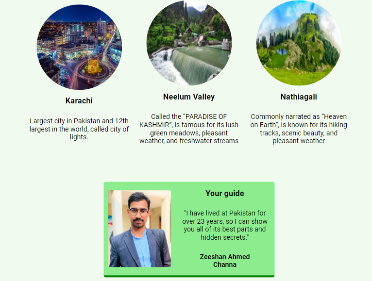

# Project: Travel Visit Landing Page

## Description:
It is basically a landing page of a travel agency that offers different beautiful places to travel in Paksitan.

## Teach Stack:
- HTML
- CSS
- CSS Flexbox
- JavaScript
- DOM

## Output:

Happy Coding!
